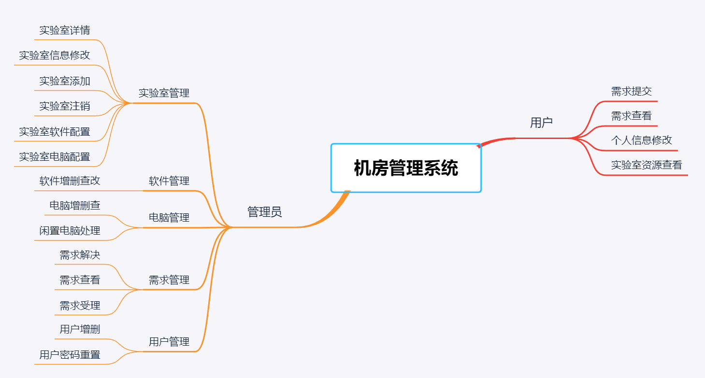
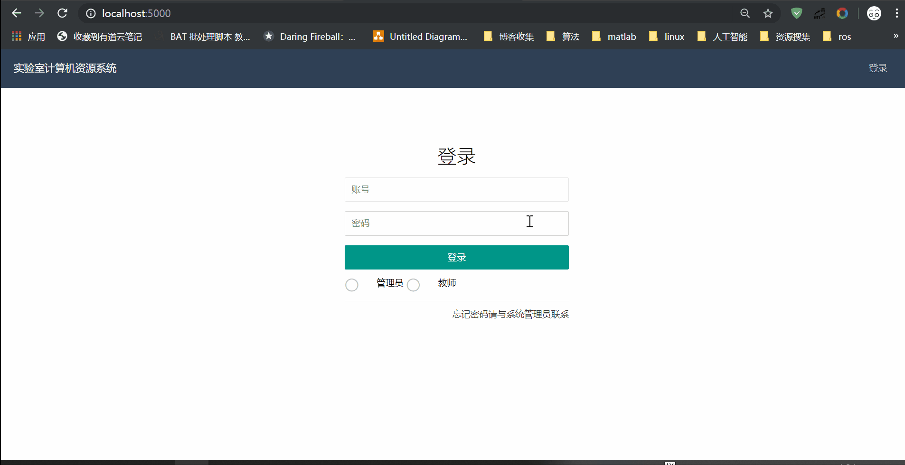
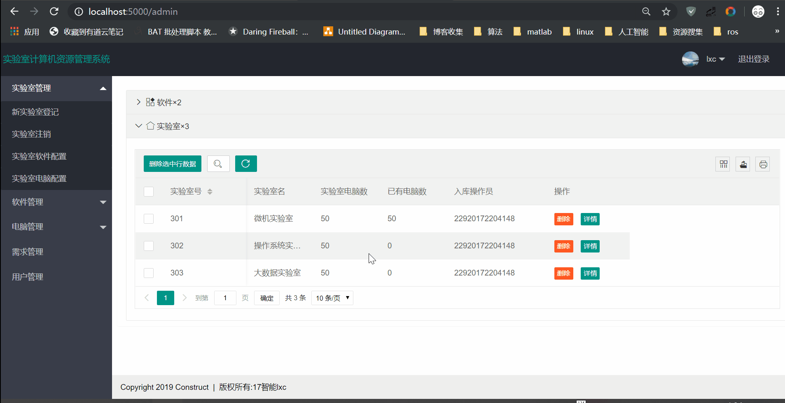
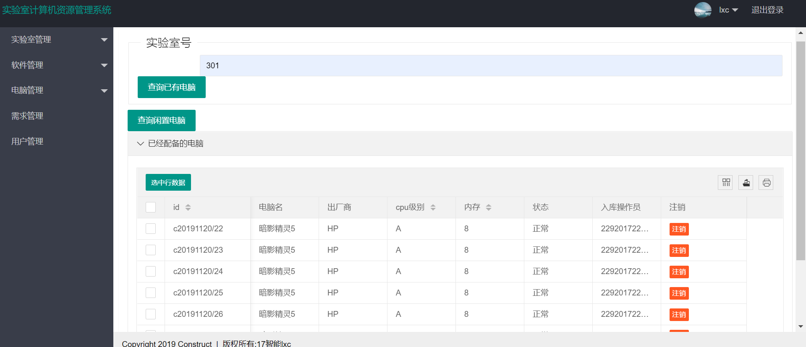
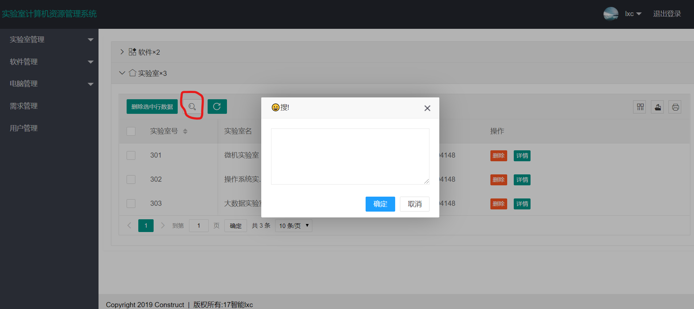
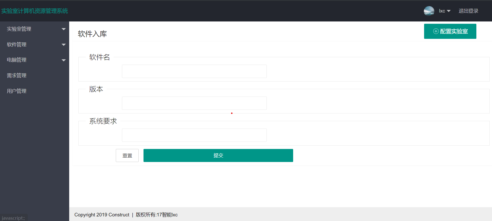
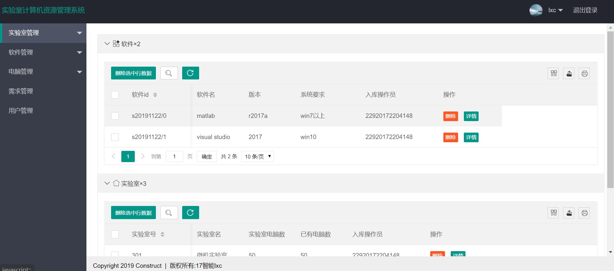
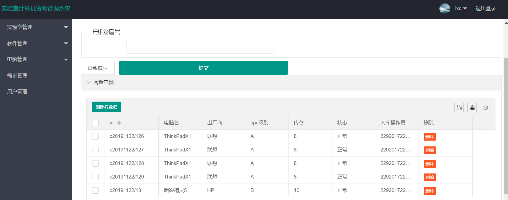
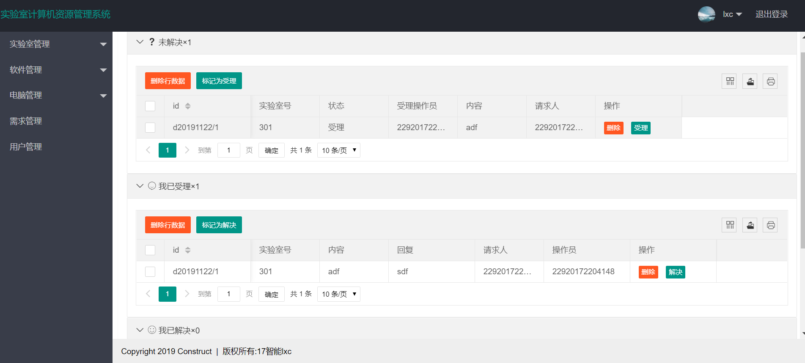
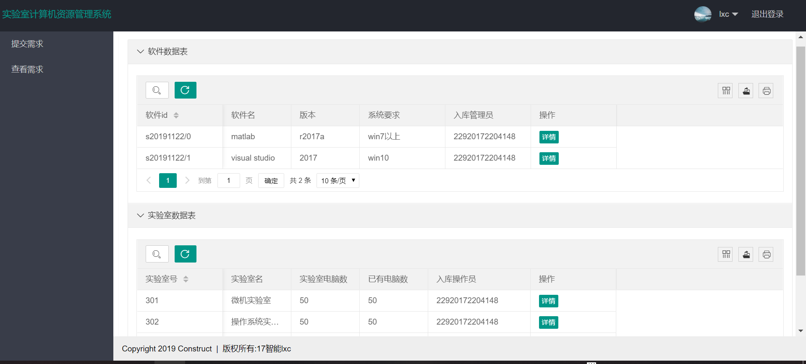

# 实验室计算机资源管理系统
本系统是一个小型的实验室计算机管理系统，基于mssql数据库进行开发，过程中使用了orm的技术，具有一定的可移植性，使得程序可以跑在不同的数据库下，在设计过程中使用了mvc的设计框架，将前后端分离，并且按照系统功能进行分区，代码阅读性较强  


[**flask**官方文档](http://docs.jinkan.org/docs/flask/)  
>>Flask是一个使用Python编写的轻量级Web应用框架。基于Werkzeug WSGI(PythonWeb服务器网关接口（Python Web Server Gateway Interface，缩写为WSGI)是Python应用程序或框架和Web服务器之间的一种接口，已经被广泛接受, 它已基本达成它的可移植性方面的目标)工具箱和Jinja2 模板引擎。然而，Flask保留了扩增的弹性，可以用Flask-extension加入这些功能：ORM、窗体验证工具、文件上传、各种开放式身份验证技术。

---
## 项目需求分析
本次大实验的项目需求如下 
- 软件管理
- 用户管理
- 实验室管理
- 计算机管理

对需求进行细化后，拓展成下面的一张需求的导图  

根据这张图，设计数据库与相应的功能。  

有关数据表的进一步的介绍，可以看这里
[实验室数据表介绍](用户文档.md)    

---
## 项目文件介绍
flask本身使用装饰器进行路由的绑定，如果需要分区，需要通过flask的blue-print[^1]模块进行相应的配置，有关每一个blue-print的配置，可以查看每个文件夹的的__init__.py  

本系统基于mvc的设计模式，对功能进行分期，得到后端程序的排布如下:

```shell
├── app.py
├── model.py
├── computer_manage
│   ├── services.py
│   └── views.py
├── demand_manage
│   ├── services.py
│   └── views.py
├── lab_manage
│   ├── services.py
│   └── views.py
├── main
│   ├── admin_main.py
│   ├── login_logout.py
│   └── user_main.py
├── software_manage
│   ├── services.py
│   └── views.py
└── user_manage
    ├── services.py
    └── views.py
```
下面的介绍过程中可以参考这个程序排布

### app模块
该模块是用于启动flask服务器的模块,在这个模块中，我主要加入了登录页的视图函数和404页面的视图函数[^2]

### model模块
该模块重要存放数据表的orm类，用于各个视图函数对数据库的访问  

### main包(blue-print)
该文件夹下主要存放了两种用户Adminitrator和Teacher登陆后的主页视图函数以及登出界面的视图函数

### lab_manage包(blue-print)
这个文件夹下主要存放的是对Laboratory数据表操作有关的视图和后端服务的函数
- views
  - 新实验室登记页
  - 实验室注销页
  - 实验室设置页
  - 实验室电脑配置页
  - 实验室详情页

- services
  - 实验室查询
  - 实验室信息设置
  - 删除实验室

### software_manage包(blue-print)
该文件夹主要存放与Software数据表操作有关的视图和服务的函数  
- views
  - 软件入库页
  - 软件详情页
- services
  - 软件查询
  - 软件删除
  - 软件安装实验室对应的电脑(可选择性地安装)
  - 将软件从实验室电脑中卸载(可选择性地卸载)
  - 查询实验室所有的软件

### computer_manage包(blue-print)
该文件夹主要存放与Computer数据表操作相关的视图和服务函数
- views
  - 电脑入库页
  - 电脑注销页
  - 实验室电脑信息页

- services
  - 查询未安装某软件的电脑
  - 查询已经按照某软件的电脑
  - 查询闲置电脑
  - 登记电脑到某实验室
  - 从某实验室注销电脑
  - 删除电脑信息

### demand_manage包(blue-print)
该文件夹主要存放与Demand数据表操作相关的视图和服务函数  
- views
  - 需求提交页
  - 需求查看页
  - 需求管理页

- services
  - 查看教师已解决需求
  - 查看教师未解决需求
  - 查看所有未解决需求
  - 教师删除需求
  - 查看管理员自己已经受理的需求
  - 查看管理员自己已经解决的需求
  - 管理员受理需求
  - 管理员对需求进行回复
  - 管理员删除已经解决的需求
### user_manage包(blue-print)
该文件夹主要存放与Adminitrator数据表和Teacher数据表操作相关的视图和服务函数
- views
  - 用户管理页
  - 用户信息修改页(嵌入用户密码修改功能)

- services 
  - 显示已有的用户
  - 删除已有用户
  - 重置已有用户信息

---
## 使用环境配置
- python3.6
- flask1.1.1
- pyodbc
- sqlalchemy
- wtforms
- werkzeug
- pymssql

建议使用conda进行安装，这样可以安装软件包的同时把依赖的包也同时装上  

---
## 使用说明与演示

本系统中主要有两个角色  
- 管理员Admin
- 教师Teacher


先确定已经配置好环境，在`mvc_mode_labSys`目录下终端输入`flask run`运行程序

### 登陆页  

### Admin

#### 实验室管理相关
**新增实验室与实验室注销**  

**实验室电脑配置** 
 
**实验室软件配置** 

**实验室查询**

### 软件管理相关
**软件加入与删除**  
  
  
### 电脑管理相关
**电脑加入与闲置处理**
  

### 需求管理相关  
**未解决-受理-解决-回复-删除**


### Teacher
#### 查询搜索

#### 需求提交


---
[^1]: [blue-print](http://docs.jinkan.org/docs/flask/blueprints.html):蓝图，flask中用于模块化的一个工具
[^2]: [视图函数](http://docs.jinkan.org/docs/flask/tutorial/views.html): flask中利用python的装饰器将函数绑定到指定的路由上，用于访问该路由就会调用对应的端点函数